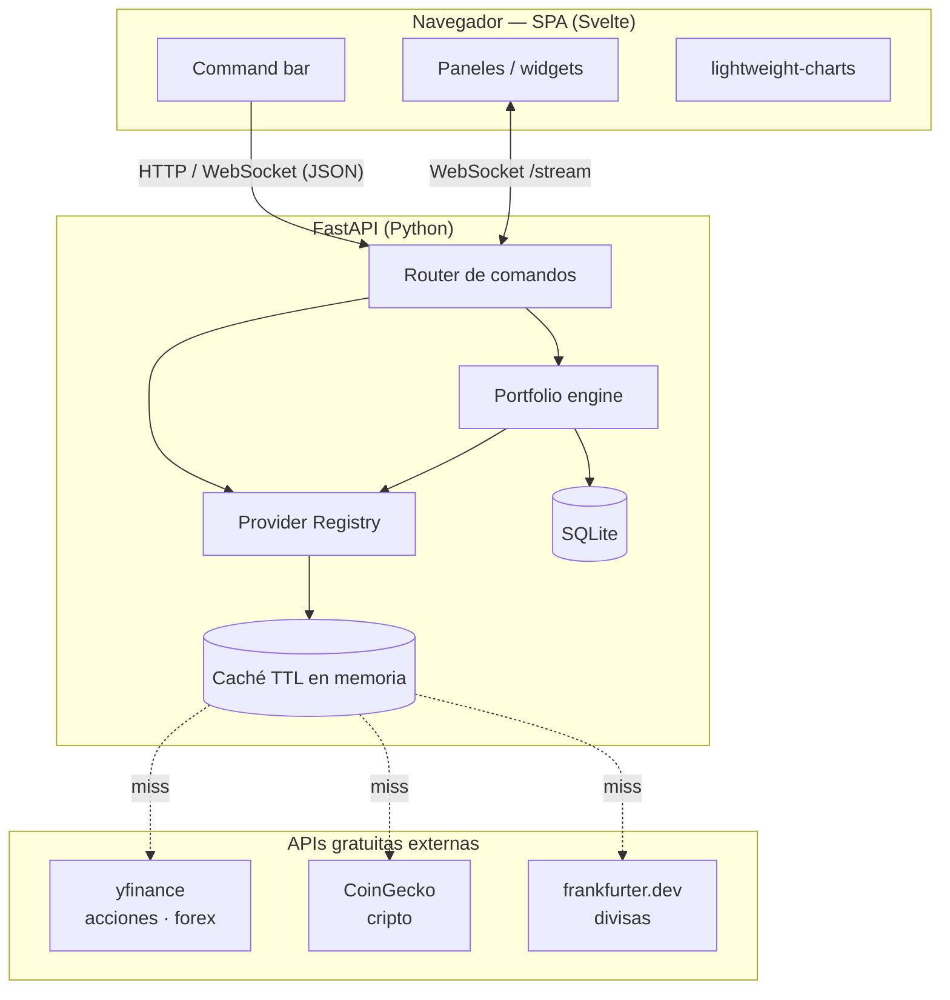
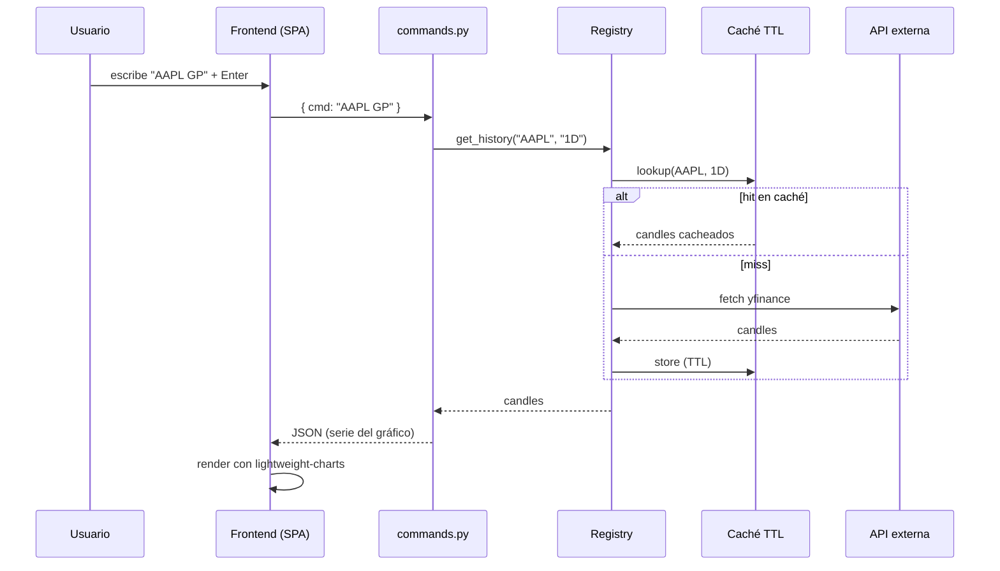
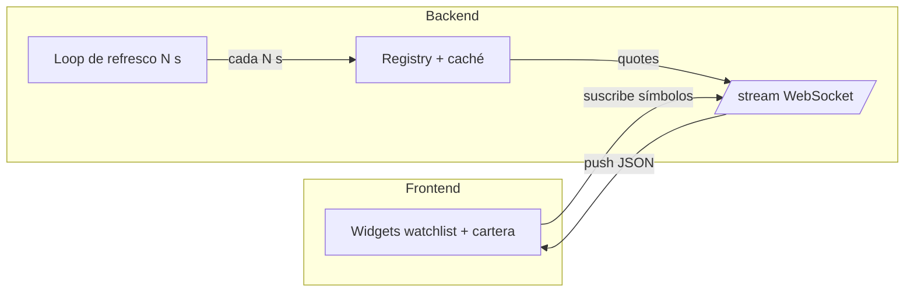
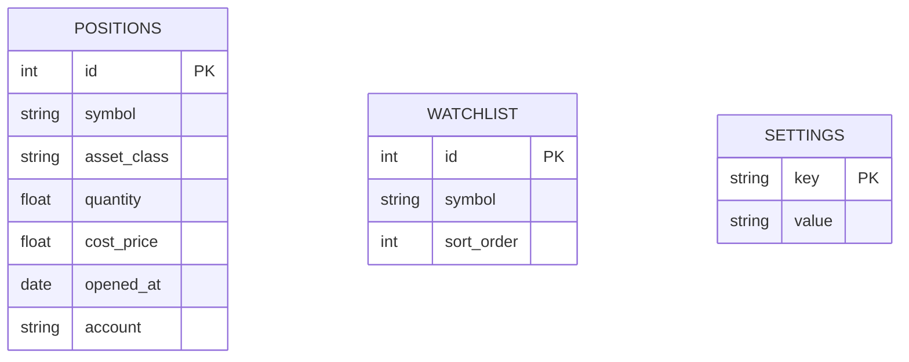

# sterminal — Especificación (viva)

> **Documento vivo.** Refleja el estado actual del proyecto y se actualiza al cerrar
> cada ciclo de feature (ver [`docs/sys/workflow.md`](workflow.md), sección D y H).
> El original congelado de partida está en [`spec-initial.md`](spec-initial.md) — no se
> modifica nunca. Esta copia sí se edita: cuenta la historia real del proyecto.

> Terminal financiero personal, estilo Bloomberg. App web local y privada que corre en
> la Raspberry Pi del usuario. Multi-activo (acciones/ETFs, cripto, forex/materias primas),
> datos de APIs gratuitas, navegación por línea de comandos con teclado, y cartera real
> por entrada manual/CSV con P&L en vivo.

- **Estado:** MVP completo (11/11 features), pendiente de review y merge del owner.
- **Features implementadas:**
  - feat-1 — Esqueleto backend: FastAPI + SQLite (esquema `positions`/`watchlist`/
    `settings`) + interfaz `Provider` (`Protocol`). Ver
    [`docs/sys/features/feat-1-backend-skeleton.md`](features/feat-1-backend-skeleton.md)
    y [`docs/plans/plan-1-backend-skeleton.md`](../plans/plan-1-backend-skeleton.md).
  - feat-2 — Providers base: `EquityProvider` (yfinance), `CryptoProvider` (CoinGecko),
    `FxProvider` (frankfurter.dev, migrado desde exchangerate.host — ver corrección de
    `WATCH` más abajo), los tres cumpliendo el `Protocol Provider` de feat-1. Ver
    [`docs/sys/features/feat-2-providers-base.md`](features/feat-2-providers-base.md)
    y [`docs/plans/plan-2-providers-base.md`](../plans/plan-2-providers-base.md).
  - feat-3 — Registry (`registry.py`, enruta símbolo→provider y desambigua clases de
    activo) + caché TTL en memoria (`cache.py`). Ver
    [`docs/sys/features/feat-3-registry-cache.md`](features/feat-3-registry-cache.md)
    y [`docs/plans/plan-3-registry-cache.md`](../plans/plan-3-registry-cache.md).
  - feat-4 — Parser de comandos (`commands.py`): tokeniza `[SÍMBOLO] [FUNCIÓN]` o
    `FUNCIÓN` y produce un `Command` estructurado (parsing puro, sin ejecutar nada). Ver
    [`docs/sys/features/feat-4-command-parser.md`](features/feat-4-command-parser.md)
    y [`docs/plans/plan-4-command-parser.md`](../plans/plan-4-command-parser.md).
  - feat-6 — Portfolio engine (`portfolio.py`): CRUD de posiciones sobre SQLite, P&L en
    vivo por posición y agregado, coste medio ponderado, % de asignación, P&L diario,
    import/export CSV. Ver
    [`docs/sys/features/feat-6-portfolio-engine.md`](features/feat-6-portfolio-engine.md)
    y [`docs/plans/plan-6-portfolio-engine.md`](../plans/plan-6-portfolio-engine.md).
  - feat-5 — Endpoints REST (`command_router.py`): `POST /command` único, despacha por
    `CommandType` (feat-4) a `Registry`/`PortfolioEngine`. Ver
    [`docs/sys/features/feat-5-rest-endpoints.md`](features/feat-5-rest-endpoints.md)
    y [`docs/plans/plan-5-rest-endpoints.md`](../plans/plan-5-rest-endpoints.md).
  - feat-7 — WebSocket `/stream` (`stream_router.py`): push periódico de cotizaciones
    reutilizando el `Registry`. Ver
    [`docs/sys/features/feat-7-websocket-stream.md`](features/feat-7-websocket-stream.md)
    y [`docs/plans/plan-7-websocket-stream.md`](../plans/plan-7-websocket-stream.md).
  - feat-8 — Esqueleto frontend (`frontend/`, Svelte + Vite + pnpm): barra de comando
    siempre enfocada, historial ↑/↓, layout de rejilla, fiel a
    [`init-specs/DESIGN.md`](init-specs/DESIGN.md). Ver
    [`docs/sys/features/feat-8-frontend-skeleton.md`](features/feat-8-frontend-skeleton.md)
    y [`docs/plans/plan-8-frontend-skeleton.md`](../plans/plan-8-frontend-skeleton.md).
  - feat-9 — Panel de gráfico (`ChartPanel.svelte`, `lightweight-charts`): velas del
    histórico `GRAPH_PRICE`, selector de rango `1D/1W/1M/1Y`. Ver
    [`docs/sys/features/feat-9-frontend-chart.md`](features/feat-9-frontend-chart.md)
    y [`docs/plans/plan-9-frontend-chart.md`](../plans/plan-9-frontend-chart.md).
  - feat-10 — Paneles `PORT`/`WATCH` (`PortfolioPanel.svelte`, `WatchlistPanel.svelte`):
    cartera vía `POST /command`, watchlist en vivo vía WebSocket `/stream` (feat-7). Ver
    [`docs/sys/features/feat-10-frontend-panels.md`](features/feat-10-frontend-panels.md)
    y [`docs/plans/plan-10-frontend-panels.md`](../plans/plan-10-frontend-panels.md).
  - feat-11 — Estados stale/error end-to-end (`ErrorPanel.svelte`): nunca pantalla en
    blanco ante un fallo del backend o de red; cierra el gap de "símbolo no encontrado"
    detectado probando feat-5 en vivo. Ver
    [`docs/sys/features/feat-11-stale-error-states.md`](features/feat-11-stale-error-states.md)
    y [`docs/plans/plan-11-stale-error-states.md`](../plans/plan-11-stale-error-states.md).
- **Fecha:** 2026-07-08
- **Stack elegida:** FastAPI (Python) + frontend Svelte + TradingView lightweight-charts + SQLite.
- **Diseño visual/UX (definitivo):** ver [`init-specs/DESIGN.md`](init-specs/DESIGN.md) —
  documento de diseño a aplicar en el desarrollo, con su prototipo autocontenido
  [`init-specs/sterminal.dc.html`](init-specs/sterminal.dc.html) (temas cobalt/amber/phosphor,
  layouts focus/grid, barra de comando, paneles y estados live/stale/error).
- **Brief de diseño (origen):** [`init-specs/design-brief.md`](init-specs/design-brief.md) —
  el brief con el que se generó el diseño (referencias visuales, comandos, prioridades y anti-patrones).

---

## 1. Objetivos y principios

- **Fiel al espíritu Bloomberg:** pantalla densa, teclado ante todo, barra de comando siempre presente.
- **Personal y privado:** todo corre en local, sin cuentas ni telemetría, sin autenticación (uso de un solo usuario en su máquina).
- **Ligero:** debe volar en una Raspberry Pi 5. Sin frameworks pesados, caché agresiva.
- **Multi-activo:** acciones/ETFs, cripto y forex/materias primas bajo la misma interfaz.
- **Extensible:** añadir una fuente de datos nueva no debe tocar el resto del sistema.
- **YAGNI:** nada de trading real, brokers ni multiusuario en la v1.

---

## 2. Arquitectura general

Tres capas con fronteras claras: **frontend** (render + teclado), **API/comandos**
(traduce comando → acción) y **providers + engine** (datos y cálculo). Cada provider
implementa la misma interfaz, así que añadir una fuente no toca el resto.



---

## 3. Componentes del backend

| Módulo | Responsabilidad |
|---|---|
| `providers/` | Un módulo por fuente, todos con interfaz común. `EquityProvider` (yfinance), `CryptoProvider` (CoinGecko), `FxProvider` (frankfurter.dev). |
| `registry.py` | Enruta el símbolo a su provider según clase de activo; desambigua choques. |
| `cache.py` | Caché en memoria con TTL para respetar límites de las APIs gratuitas. Clave por símbolo + resolución. |
| `portfolio.py` | Lee posiciones de SQLite, cruza con precios en vivo, calcula P&L, coste medio, % asignación, P&L diario. Import/export CSV. |
| `commands.py` | Parser del lenguaje de comandos. Mapea entrada → handler → payload JSON. |
| `app.py` | FastAPI: endpoints REST + WebSocket `/stream` que empuja precios de watchlist/cartera cada N segundos. |

### Interfaz común de provider

Todos los providers cumplen el mismo contrato, lo que permite añadir fuentes (o, más
adelante, conectores de exchange) sin reescribir el router ni el engine:

```
class Provider(Protocol):
    def get_quote(symbol) -> Quote
    def get_history(symbol, resolution) -> list[Candle]
    def search(query) -> list[SymbolMatch]
    def get_news(symbol) -> list[NewsItem]
```

TTL de caché sugerido: cotización ~15 s, histórico intradía ~1 min, histórico diario ~5 min.

### Estructura del proyecto backend e implementación (desde feat-1)

- **Paquete:** `backend/` en la raíz del repo, src-layout con el código en
  `backend/app/` y tests en `backend/tests/`:

  ```
  backend/
    pyproject.toml
    app/
      __init__.py
      main.py          # FastAPI app + endpoint de health-check
      db.py             # conexión SQLite + init_db()
      models.py         # Quote, Candle, SymbolMatch, NewsItem
      providers/
        __init__.py
        base.py         # Protocol Provider
    tests/
      __init__.py
      test_app.py
      test_db.py
      test_provider_protocol.py
  ```

  Se usa src-layout (en vez de paquete plano en la raíz) para dejar sitio a un futuro
  `frontend/` en la raíz sin mezclar código Python y JS/TS en el mismo nivel.
- **Gestor de dependencias:** `pip` + `venv` estándar, con `backend/pyproject.toml`
  (build backend `setuptools`) como fuente única de metadatos y dependencias runtime
  (`fastapi`, `uvicorn`) y de test (`pytest`, `httpx`). Elegido por cero fricción y cero
  tooling externo adicional en la Raspberry Pi (nada de `poetry`/`uv`).
  Entorno virtual local en `backend/.venv`, ignorado por git.
- **SQLite:** módulo `sqlite3` de la librería estándar, sin ORM — suficiente para el
  esquema de tres tablas de la sección 6.
- **Tipos de dominio (`Quote`, `Candle`, `SymbolMatch`, `NewsItem`):** `dataclasses`
  estándar de Python, no modelos pydantic — para mantener el `Protocol Provider`
  desacoplado de FastAPI/pydantic. Son tipos de dominio internos; si hace falta
  serializarlos a modelos de request/response HTTP, eso se resuelve en los endpoints de
  negocio (feature 5), que podrán envolverlos o mapearlos.
- **Convención de tests:** `pytest`, un fichero de test por módulo principal
  (`test_app.py`, `test_db.py`, `test_provider_protocol.py`), ejecutado desde `backend/`.
  Sin llamadas a red real en los tests (aplica también a providers futuros, ver sección
  9).

### Providers implementados (desde feat-2)

- **`EquityProvider`** (`backend/app/providers/equity.py`): acciones/ETFs vía
  `yfinance`. Símbolo de entrada: ticker de Yahoo Finance tal cual (`AAPL`, `MSFT`,
  ...). `get_history` devuelve OHLCV completo, sin limitaciones conocidas.
- **`CryptoProvider`** (`backend/app/providers/crypto.py`): cripto vía la API pública de
  CoinGecko (HTTP directo con `httpx.Client` inyectable). Símbolo de entrada: **id de
  CoinGecko** (`bitcoin`, `ethereum`, ...), no el ticker corto (`BTC`) — mapear
  ticker→id es responsabilidad de `registry.py` (feature 3); mientras tanto, `search()`
  permite resolverlo a mano. `get_history` usa `/coins/{id}/ohlc` (OHLC real) pero
  **sin volumen** en el tier gratuito (`Candle.volume` queda a `0.0`). `get_news`
  devuelve `[]` de forma documentada — CoinGecko no expone noticias por activo en su
  API pública gratuita.
- **`FxProvider`** (`backend/app/providers/fx.py`): forex vía la API pública de
  **frankfurter.dev** (tasas del BCE, gratuita, sin API key — migrada desde
  exchangerate.host, ver corrección en la sección de `WATCH`/feat-11 más abajo). Símbolo
  de entrada: par de 6 caracteres `BASECOTIZADA` (ej. `EURUSD` = base EUR, cotizada USD).
  `get_history` da un único rate por día (`/{start}..{end}`), **sin OHLC intradía** —
  cada `Candle` se construye con `open=high=low=close=rate` del día y `volume=0.0`. Sin
  materias primas (oro/plata) — fuera de alcance del MVP de todos modos. `get_news`
  devuelve `[]` de forma documentada.
- **Dependencias runtime nuevas:** `yfinance` y `httpx` en `[project].dependencies` de
  `backend/pyproject.toml` (`httpx` ya estaba como dependencia de test, ahora también de
  runtime).
- **Tests:** fixtures HTTP grabadas en `backend/tests/fixtures/`; `CryptoProvider`/
  `FxProvider` mockean el transporte con `httpx.MockTransport`, `EquityProvider` usa
  factories inyectables (`ticker_factory`, `search_factory`) porque `yfinance` no
  expone un cliente HTTP interceptable de forma estable entre versiones.

### Registry y caché implementados (desde feat-3)

- **`Registry`** (`backend/app/registry.py`): recibe los tres providers por inyección de
  dependencia (constructor `Registry(equity_provider, crypto_provider, fx_provider,
  cache=None)`, acepta reales o fakes) y expone `get_quote(symbol, asset_class=None)`,
  `get_history(symbol, resolution="1D", asset_class=None)`, `search(query)`.
- **Detección de clase de activo (heurística por defecto, sin hint), en este orden:**
  1. Símbolo de 6 letras cuyos 3 primeros y 3 últimos caracteres están en una tabla de
     códigos ISO 4217 conocidos → `fx`.
  2. Símbolo en una tabla de alias cripto conocidos (`BTC`, `ETH`, `USDT`, `BNB`, `SOL`,
     `XRP`, `ADA`, `DOGE`, `TON`, `DOT`) → `crypto`.
  3. Cualquier otro caso → `equity` (fallback).
  Esto resuelve el choque `BTC` de la sección 4 de forma determinista: por defecto va a
  `CryptoProvider`.
- **Desambiguación explícita:** `get_quote`/`get_history` aceptan `asset_class:
  Literal["equity", "crypto", "fx"] | None = None`; si se pasa, salta la heurística y
  fuerza esa clase (ej. `asset_class="equity"` para tratar `"BTC"` como ticker
  bursátil). Un valor no reconocido lanza `UnknownSymbolError`. Es el mecanismo que una
  capa futura (parser/router, UI de "¿acción o cripto?") podrá usar; esta feature no
  construye esa UI.
- **Traducción símbolo de usuario → formato interno del provider:** equity y fx se pasan
  en mayúsculas tal cual; crypto se traduce al id de CoinGecko vía la tabla de alias
  (`"BTC"` → `"bitcoin"`) o, si no está en la tabla, se pasa en minúsculas tal cual
  (soporta ids de CoinGecko ya resueltos vía `search()`, ej. `"the-open-network"`).
  Limitación conocida y aceptada: tickers equity con guion (ej. `"BRK-B"`) no chocan con
  ids de CoinGecko en minúsculas-con-guion porque los tickers de Yahoo son siempre
  mayúsculas — sin ambigüedad real, documentado por completitud.
- **`search(query)`:** agrega `list[SymbolMatch]` de los tres providers en orden
  `equity, crypto, fx`, sin deduplicar ni rankear, y sin caché (operación interactiva de
  baja frecuencia).
- **`cache.py` — `TTLCache`:** caché genérica en memoria, no conoce símbolos ni
  providers (`get(key)`/`set(key, value, ttl_seconds)`/`invalidate(key)`/`clear()`,
  claves hashables arbitrarias), con reloj inyectable (`time.monotonic` por defecto)
  para controlar expiración en tests sin `sleep()` real. Solo in-memory, sin persistir
  entre reinicios del proceso.
- **TTL realmente implementados** (el `Registry` construye las claves de caché
  `("quote", asset_class, symbol_interno)` y `("history", asset_class, symbol_interno,
  resolution)`):
  - `get_quote` → 15 s siempre.
  - `get_history`: los providers solo exponen las resoluciones `1D`/`1W`/`1M`/`1Y`,
    ninguna verdaderamente intradía todavía; como aproximación, `"1D"` usa el TTL de
    histórico intradía (60 s) y `"1W"`/`"1M"`/`"1Y"` usan el de histórico diario (300 s).
    Se revisita si una feature futura añade una resolución intradía real.
  - `search` → sin caché (no definida en la sección 3).
- **Dependencias:** ninguna nueva — solo librería estándar (`time`).

### Parser de comandos implementado (desde feat-4)

- **`commands.py`** (`backend/app/commands.py`): expone `parse_command(raw: str) ->
  Command`, capa de parsing pura — no llama al registry ni a ningún provider, no toca
  HTTP. Tokeniza con `str.split()` (colapsa espacios repetidos y descarta los de los
  extremos) y decide la rama de parsing por número de tokens (0, 1, 2, 3+).
- **`Command`** (dataclass `frozen=True`): `type: CommandType`, `symbol: str | None`,
  `raw: str` (cadena original tal cual la escribió el usuario, sin normalizar, para
  logging/debug). Mismo criterio que `Quote`/`Candle` (feat-1): dataclass estándar, no
  pydantic — tipo de dominio interno.
- **`CommandType`** (`enum.Enum` de cadena): `SUMMARY`, `GRAPH_PRICE`, `NEWS`,
  `PORTFOLIO`, `WATCHLIST`, `MOVERS`, `HELP` — 7 miembros que cubren las 8 filas de la
  tabla de la sección 4 (`EURUSD` comparte `SUMMARY` con `AAPL`; la clase de activo no
  se resuelve en el parser, sigue siendo trabajo del registry en feat-3/feat-5).
- **Distinción "con símbolo" vs. "sin símbolo":** dos tablas explícitas en vez de un
  único diccionario — `_SYMBOL_FUNCTIONS` (`GP`→`GRAPH_PRICE`, `NEWS`→`NEWS`, exigen
  símbolo) y `_NO_SYMBOL_FUNCTIONS` (`PORT`→`PORTFOLIO`, `WATCH`→`WATCHLIST`,
  `MOVERS`→`MOVERS`, `HELP`→`HELP`, no lo aceptan). Un único token que no aparece en
  ninguna tabla se interpreta como símbolo desnudo → `SUMMARY` (cubre `AAPL`, `EURUSD`,
  `BTC` sin función). Símbolo y función se normalizan a mayúsculas (`token.upper()`) —
  case-insensitive, coherente con la normalización de `registry.py` (feat-3).
- **Validación de forma de símbolo:** regex `^[A-Z0-9][A-Z0-9.\-]{0,14}$` (empieza por
  letra/dígito, permite letras/dígitos/punto/guion, máximo 15 caracteres); no valida
  existencia real (eso requiere red, fuera de alcance del parser).
- **Manejo de errores — jerarquía de excepciones tipadas**, no un resultado con campo de
  error: `CommandParseError(ValueError)` como base (mismo patrón que
  `UnknownSymbolError(ValueError)` en `registry.py`, para que un `except ValueError`
  amplio también las capture), con subclases `EmptyCommandError` (cadena vacía/solo
  espacios), `UnknownCommandError` (función desconocida), `InvalidSymbolError` (símbolo
  con formato inválido), `MissingSymbolError` (función que exige símbolo y no lo
  recibe), `UnexpectedSymbolError` (función que no acepta símbolo y lo recibe) y
  `TooManyTokensError` (3+ tokens). `parse_command` nunca deja escapar una excepción
  fuera de esta jerarquía para una entrada `str` — ningún typo común propaga
  `IndexError`/`KeyError`/`AttributeError` sin controlar, verificado con un test de
  robustez parametrizado.
- **Dependencias:** ninguna nueva — solo librería estándar (`dataclasses`, `enum`,
  `re`).

### Portfolio engine implementado (desde feat-6)

- **`PortfolioEngine`** (`backend/app/portfolio.py`): recibe por inyección de
  dependencia una `sqlite3.Connection` (la que devuelve `db.init_db()`) y un
  `Registry`-compatible (constructor `PortfolioEngine(conn, registry)`), mismo patrón
  que `Registry` con sus providers. CRUD completo sobre `positions` (alta/lectura/
  actualización/baja).
- **Dos niveles de posición:** la tabla `positions` modela **lotes de compra**
  individuales (`opened_at` por fila). `PortfolioEngine` expone P&L a nivel de fila
  (`PositionPnL`, sin agregar) y a nivel agregado por símbolo (`holdings()`), que es el
  nivel que de verdad importa para coste medio, % de asignación y P&L diario, y el que
  consumirá el comando `PORT`. Agregación por `(symbol, asset_class)`, sin distinguir
  `account`.
- **Coste medio ponderado:** `avg_cost_price = sum(quantity_i * cost_price_i) /
  sum(quantity_i)` sobre las filas de un mismo `(symbol, asset_class)`.
- **% de asignación:** `market_value / total_market_value * 100` sobre el total de
  todos los holdings de la cartera (no solo los de la misma clase de activo); `0.0` si
  el total es 0 en vez de dividir por cero.
- **P&L diario — precio de referencia exacto:** se obtiene `Registry.get_history(symbol,
  "1D", asset_class=...)` (velas en orden cronológico ascendente) y se toma la
  **penúltima vela** (`candles[-2].close`) como cierre de referencia, no la última —
  porque la última vela de un histórico "1D" puede ser la sesión de hoy aún sin cerrar.
  Con menos de 2 velas, `previous_close`/`daily_pnl`/`daily_pnl_percent` quedan en
  `None` sin lanzar excepción (histórico insuficiente es un caso legítimo, ej. símbolo
  recién listado).
- **Import CSV — validación fila a fila, sin abortar el import:** columnas `symbol,
  quantity, cost_price, date, account` (sección 6). Cada fila se valida
  independientemente: `symbol` no vacío tras `strip()`, `quantity` y `cost_price`
  parseables como `float` y estrictamente positivos; `account` opcional; `date` se
  guarda tal cual como `opened_at` sin validar formato. La fila que falla cualquier
  check se añade a `rejected` (con motivo legible) y el import continúa con el resto —
  nunca aborta el CSV completo por una fila inválida. `asset_class` no viaja en el CSV;
  se resuelve automáticamente por fila vía `Registry.resolve()`.
- **Export CSV:** genera las mismas columnas (`symbol, quantity, cost_price, date,
  account`) a partir de las filas crudas (`list_positions()`, sin agregar), de forma
  que export→import es un round-trip fiel sin perder lotes individuales. Import/export
  trabajan en memoria sobre `str` (`import_csv(csv_text)` / `export_csv() -> str`), sin
  tocar disco — la capa que use ficheros o upload HTTP (feature 5) decide el transporte.
- **Limitación documentada — sin multi-moneda:** el cálculo de P&L no convierte
  divisas; cada posición se valora en la moneda que devuelve el `Quote` del provider
  correspondiente, sin infraestructura de FX de portafolio (fuera de alcance del MVP).
- **Dependencias:** ninguna nueva — solo librería estándar (`sqlite3`, `csv`, `io`,
  `dataclasses`).

### Endpoints REST implementados (desde feat-5)

- **`POST /command`** (`backend/app/command_router.py`): un único endpoint en vez de
  una ruta por tipo de comando — parsea el body (`{"input": "...", "resolution":
  "1D"|"1W"|"1M"|"1Y"|null}`, `resolution` opcional para `GRAPH_PRICE`, feat-9) con
  `commands.parse_command` (feat-4) y despacha por `CommandType`: `SUMMARY` (quote +
  clase de activo), `GRAPH_PRICE` (histórico), `PORTFOLIO` (holdings + resumen de
  `PortfolioEngine`, feat-6), `HELP` (generado desde las tablas de `commands.py`, no
  hardcodeado). `NEWS`/`WATCHLIST`/`MOVERS` → `400` explícito (fuera de alcance del MVP,
  o servidos por otro medio — `WATCH` en vivo es el WebSocket de feat-7).
- **Errores siempre `400`, nunca `500`:** tanto errores de parseo (`CommandParseError`,
  feat-4) como de datos (símbolo no resoluble) se normalizan a `400` con mensaje claro y,
  cuando las hay, sugerencias de `Registry.search()`.
- **Símbolo no encontrado (cierra un gap real de feat-11):** ni `registry.py` ni los
  providers lanzan una excepción unificada para "no existe" — `EquityProvider`
  (yfinance) devuelve un `Quote`/histórico vacío (precio `0.0`, sin velas) en vez de
  fallar. `command_router` detecta esa señal (precio `0.0` en `SUMMARY`, sin velas en
  `GRAPH_PRICE`) y la trata como símbolo no encontrado → mismo mecanismo de `400` +
  sugerencias.
- **`Registry`/`PortfolioEngine`** se instancian una única vez en el `lifespan` de
  FastAPI con los providers reales, guardados en `app.state` (`backend/app/deps.py` los
  inyecta a los routers; los tests los sustituyen vía `app.dependency_overrides`, sin
  red real).
- **Dependencias:** ninguna nueva — `pydantic` (ya viene con FastAPI).

### WebSocket /stream implementado (desde feat-7)

- **`stream_router.py`** (`app.include_router` en `main.py`): el cliente se suscribe a
  una lista de símbolos (`{"subscribe": [...]}`) y recibe pushes `{"quotes": [...]}` a
  intervalos regulares. Reutiliza el `Registry` y su caché TTL (feat-3) — este módulo no
  duplica lógica de caché, solo refresca y empuja.
- **Intervalo por defecto ~15s** (spec.md secciones 5/11), inyectable como dependencia
  para que los tests no dependan de esperas reales.
- **Un loop de refresco por conexión activa**, sin loop global compartido — aceptable
  para el MVP (un solo usuario, self-hosted). Limitación de escalabilidad documentada y
  no resuelta a propósito (YAGNI): si hubiera muchas conexiones concurrentes, cada una
  refresca por su cuenta en vez de compartir un único loop de fan-out.
- Resuscripción en caliente (nuevo mensaje `subscribe` reemplaza la lista anterior) y
  manejo de desconexión (`WebSocketDisconnect`) sin dejar tareas huérfanas.
- **Dependencias:** ninguna nueva — solo librería estándar (`asyncio`).

### Frontend implementado (desde feat-8)

- **`frontend/`** (Svelte 5 + Vite + TypeScript, `pnpm`): barra de comando (`CommandBar.svelte`)
  siempre enfocada, con historial navegable (↑/↓, `commandHistory.ts`). Envía
  `POST /command` (`lib/api.ts`, mismo formato que `command_router.py`) y despacha la
  respuesta al panel correspondiente según `type` (`lib/dispatch.ts`).
- **`PanelRouter.svelte`**: en esta etapa solo enruta `welcome` (pantalla de bienvenida),
  `summary` (`SummaryPanel.svelte`) y `help` (`HelpPanel.svelte`) — los paneles de
  gráfico/cartera/watchlist/error llegan en feat-9/10/11 y sustituyen el placeholder
  genérico de "no implementado todavía".
- **`lib/api.ts`**: `CommandApiError` tipado para cualquier fallo (4xx/5xx del backend o
  red caída) — nunca deja la UI a medias sin explicación (spec.md sección 8), aunque el
  panel de error dedicado (`ErrorPanel`) no llega hasta feat-11.
- **Tema visual:** fiel a `docs/sys/init-specs/DESIGN.md` (densidad, JetBrains Mono,
  colores por signo ya en `lib/format.ts`).
- **Tests:** Vitest, para la lógica no visual (`dispatch`, `commandHistory`, `format`,
  `api`) — sin cobertura E2E/visual exhaustiva para el MVP.

### Panel de gráfico implementado (desde feat-9)

- **`ChartPanel.svelte`**: velas (`CandlestickSeries` de `lightweight-charts`) a partir
  de `GRAPH_PRICE.candles`, transformadas por `lib/chartData.ts` (`toLightweightSeries`,
  función pura, testeable sin `<canvas>` real).
- **Rangos soportados: `1D`/`1W`/`1M`/`1Y`** (`SUPPORTED_RANGES` en `chartData.ts`) — los
  únicos que el backend realmente sirve (`registry.py`/`command_router.py`), no se
  inventan rangos adicionales. Pulsar un rango ya activo no repite la petición
  (`nextRangeRequest`).
- **`activeRange`/`onRangeChange`** viven en `App.svelte` (no en el panel): al cambiar de
  rango, `App.svelte` vuelve a pedir `POST /command` con el `resolution` nuevo (feat-5) y
  sustituye la respuesta — el panel solo dibuja lo que recibe.
- **Dependencias nuevas:** `lightweight-charts` (ya declarada desde feat-8 en
  `package.json`, sin usar hasta ahora).

### Paneles PORT/WATCH implementados (desde feat-10)

- **`PortfolioPanel.svelte`**: consume `PORTFOLIO.holdings`/`summary` (feat-6 vía feat-5)
  directamente — sin estado propio, se recalcula en cada `POST /command`. Colores por
  signo y formato monetario vía `lib/format.ts`.
- **`WatchlistPanel.svelte`**: conecta al WebSocket `/stream` (feat-7) al montar, se
  suscribe a `DEFAULT_WATCHLIST` (`lib/config.ts`), reconecta automáticamente con
  backoff fijo (`RECONNECT_DELAY_MS`) si la conexión cae — indicador de conexión propio,
  base para el estado "stale" que feat-11 generaliza. Mensajes parseados por
  `lib/wsMessages.ts` (`parseStreamMessage`, función pura), símbolos con error
  individual (`isQuoteError`) se muestran diferenciados sin tumbar el resto de la lista.
- **`App.svelte`**: el comando `WATCH` (palabra clave, no pasa por `POST /command`)
  activa directamente el panel — la watchlist vive enteramente en el WebSocket, no en el
  ciclo request/response del resto de comandos.
- **Dependencias:** ninguna nueva.

### Estados stale/error end-to-end implementados (desde feat-11) — MVP completo

- **`ErrorPanel.svelte`**: banner de error genérico (mensaje + sugerencias de
  `Registry.search()` cuando las hay) — nunca pantalla en blanco ante un fallo del
  backend (4xx/5xx) o de red caída (spec.md sección 8), sustituye el placeholder
  genérico de feat-8.
- **`App.svelte`**: `CommandApiError` (feat-8, `lib/api.ts`) se captura explícitamente
  (`showError`) y activa `kind = 'error'` con `errorMessage`/`errorSuggestions` — antes
  cualquier fallo caía al mismo `'unknown'` sin distinguir mensaje real de sugerencias.
- **Gap real cerrado (detectado probando feat-5 en vivo, no por los tests unitarios):**
  un símbolo inexistente devolvía `200` con `Quote(price=0.0)` en vez de un error —
  `command_router.py` (feat-5) ahora detecta esa señal (precio `0.0` en `SUMMARY`, sin
  velas en `GRAPH_PRICE`) y la trata como símbolo no encontrado → `400` + sugerencias,
  que `ErrorPanel` ya sabe mostrar.
- **`WatchlistPanel.svelte`** (feat-10) ya traía su propio indicador de
  conexión/reconexión — la base del estado "stale" para datos en vivo; feat-11 lo
  complementa con el estado de error explícito para el flujo request/response.
- **Dependencias:** ninguna nueva.
- **Con esta feature, las 11 features del MVP quedan implementadas** (ver tabla de
  estado en [`docs/plans/plan-mvp.md`](../plans/plan-mvp.md)).

### Corrección post-MVP: `WATCH` con símbolos no-equity (2026-07-08)

Detectado probando `WATCH` en vivo con la watchlist por defecto (`AAPL`/`NVDA`/`TSLA`
equity, `BTC`/`ETH`/`SOL` crypto, `EURUSD` fx): **todo lo que no era acción fallaba o se
quedaba colgado**. Dos bugs distintos, no relacionados entre sí:

- **Bug de identidad de símbolo (`stream_router.py`):** `Quote.symbol` es el símbolo
  INTERNO del provider (`registry.py` traduce `"BTC"` → `"bitcoin"` para
  `CryptoProvider`), no el que el cliente pidió en `subscribe`. El push del WebSocket
  devolvía ese símbolo interno tal cual — `WatchlistPanel.svelte` indexa las
  cotizaciones por el símbolo original, así que nunca encontraba la entrada para cripto
  y esas filas se quedaban en "esperando…" para siempre (equity no se veía afectado
  porque `registry.py` no traduce sus símbolos). Arreglado: `_quote_payload` sobreescribe
  `symbol` con el original antes de serializar. Test de regresión añadido
  (`test_translated_symbol_is_reported_as_the_requested_symbol`).
- **`exchangerate.host` roto de verdad:** confirmado en producción (no solo detectado en
  fixtures) que exige API key de pago. `FxProvider` se reescribió sobre
  **`frankfurter.dev`** (tasas oficiales del BCE, gratis, sin key, cubre las 20 divisas
  de `registry._FX_CURRENCY_CODES`). Nota: el dominio público es `frankfurter.app`, que
  ahora solo redirige (301) a `frankfurter.dev/v1` — se apunta directo ahí porque
  `httpx.Client` no sigue redirects por defecto. Fixtures y tests de
  `test_fx_provider.py` actualizados al nuevo formato de respuesta.

Ambos verificados end-to-end contra las APIs reales (no solo con fixtures mockeadas):
los 7 símbolos de la watchlist por defecto devuelven datos correctos vía `/stream` y
`POST /command`.

### feat-12 — Comando NEWS (primera feature post-MVP)

Primera iteración del bucle de mejora continua post-MVP (objetivo del owner: 9/10 con
NEWS, mejor búsqueda de símbolos, dependencias de entrada/salida, correlaciones, datos
financieros, enlaces a reports).

- **`Registry.get_news(symbol, asset_class=None)`**: mismo patrón de resolución que
  `get_quote`/`get_history`, cachea con el TTL de histórico diario (300s) — las
  noticias no son un dato de refresco tan frecuente como una cotización.
- **`command_router.py`**: `CommandType.NEWS` deja de ser "fuera de alcance" — llama a
  `registry.get_news` y devuelve `{"type": "NEWS", "symbol", "asset_class", "items"}`.
  A diferencia de `SUMMARY`/`GRAPH_PRICE` (feat-11), una lista `items: []` **no** se
  trata como "símbolo no encontrado" — es la respuesta real y documentada para
  crypto/fx (ningún proveedor gratuito les da noticias).
- **`NewsPanel.svelte`**: lista de titulares enlazados (`target="_blank"`), fuente y
  fecha relativa (`lib/format.ts::ageLabel`); estado explícito "sin noticias
  disponibles" para crypto/fx, no una lista vacía silenciosa.
- Verificado en vivo contra yfinance real: `AAPL NEWS` devuelve titulares reales,
  `BTC NEWS` devuelve `200` con `items: []`.
- **Dependencias:** ninguna nueva — `EquityProvider.get_news` ya existía desde feat-2.

### feat-13 — Búsqueda de símbolos con autocompletado

Segunda iteración del bucle post-MVP (score tras feat-12: 6/10). Base para futuras
dependencias/correlaciones entre símbolos — hace falta poder encontrarlos primero.

- **`GET /search?q=...`** (`backend/app/search_router.py`): router aparte de
  `command_router.py` — no es un `CommandType` del lenguaje de comandos, se llama en
  cada tecleo. Delega a `Registry.search` (feat-3), capado a 8 resultados. Query
  vacía/solo espacios → `[]` sin tocar los providers.
- **`CommandBar.svelte`**: dropdown de sugerencias con debounce de 250ms, solo mientras
  el valor no contiene un espacio (antes de que el usuario teclee una función como
  `GP`/`NEWS`). Un `searchToken` incremental descarta respuestas obsoletas si el
  usuario sigue escribiendo antes de que vuelva un fetch anterior.
- **Navegación por teclado dual:** ↑/↓ controlan el dropdown de sugerencias cuando está
  abierto (en vez del historial de comandos, feat-8); Enter con una sugerencia
  resaltada la selecciona sin ejecutar el comando; Escape cierra el dropdown sin borrar
  el valor. Con el dropdown cerrado, ↑/↓/Enter/Escape vuelven a su comportamiento de
  feat-8 (historial) sin cambios.
- **`searchSymbols` (`lib/api.ts`) nunca lanza** — a diferencia de `postCommand`, un
  fallo de red o del backend en la búsqueda no debe romper la barra de comando (es una
  mejora, no una función crítica); devuelve `[]` en cualquier error.
- Verificado en vivo: `GET /search?q=app` agrega resultados reales de equity y crypto
  (yfinance + CoinGecko) en una sola lista.
- **Dependencias:** ninguna nueva.

---

## 4. Lenguaje de comandos (el alma Bloomberg)

Barra de comando siempre enfocada. Sintaxis: `[SÍMBOLO] [FUNCIÓN]` o `FUNCIÓN`. Detección
automática de clase de activo por símbolo, con desambiguación cuando choca (ej. `BTC`
cripto vs. acción). Historial con ↑/↓ y autocompletado.

| Comando | Acción |
|---|---|
| `AAPL` | Panel de resumen del activo (precio, gráfico, stats). |
| `BTC GP` | Gráfico de precio (Graph Price). |
| `AAPL NEWS` | Noticias del activo. |
| `PORT` | Cartera: posiciones, P&L, asignación. |
| `WATCH` | Watchlist en vivo. |
| `EURUSD` | Cotización forex. |
| `MOVERS` | Mayores subidas/bajadas del día. |
| `HELP` | Lista de comandos. |

### Ciclo de vida de un comando



---

## 5. Actualización en vivo (WebSocket)

Los símbolos de la watchlist y de la cartera se refrescan solos vía WebSocket `/stream`,
sin recargar ni consultar a mano.



---

## 6. Persistencia (SQLite)



- **`positions`** — posiciones reales; el engine calcula P&L cruzando con precio en vivo.
- **`watchlist`** — símbolos seguidos, con orden.
- **`settings`** — moneda base, tema, intervalo de refresco.

Entrada de cartera: manual o import CSV (`symbol, quantity, cost_price, date, account`).
Export CSV para respaldo.

---

## 7. Estética

- Fondo negro, texto ámbar/verde monoespaciado (tributo Bloomberg).
- Cabeceras densas, layout de rejilla con paneles, cero ratón necesario.
- Números con color por signo (verde positivo / rojo negativo).

---

## 8. Errores y límites

- **API caída o rate-limit** → el panel muestra el último dato cacheado con aviso `stale`, nunca pantalla en blanco.
- **Símbolo no encontrado** → sugerencias vía `search()`.
- **Backend degradado** → sirve lo último conocido en lugar de fallar.

---

## 9. Testing

- **Unit:** parser de comandos, engine de P&L (con precios mockeados), import CSV.
- **Providers:** respuestas HTTP grabadas como fixtures; los tests no pegan a la red real.
- **Smoke test:** flujo completo comando → JSON.

---

## 10. Fuera de alcance (v1)

Órdenes reales / trading, conexión a brokers, alertas push, multiusuario y autenticación
(es local). La interfaz común de providers se diseña para poder añadir conectores de
exchange más adelante **sin reescribir** el núcleo.

---

## 11. Preguntas abiertas / decisiones futuras

- Confirmar proveedor de noticias gratuito (yfinance expone algo; evaluar alternativa).
- Intervalo `N` de refresco del WebSocket (arrancar en ~15 s, configurable en `settings`).
- Framework de frontend definitivo (Svelte recomendado por peso; confirmar en el plan).
- ~~`exchangerate.host` ahora exige API key~~ — **resuelto** (detectado en feat-2,
  corregido probando `WATCH` en vivo, ver más abajo): `FxProvider` se migró a
  `frankfurter.dev`, gratuito y sin key. Ya no es una pregunta abierta.
