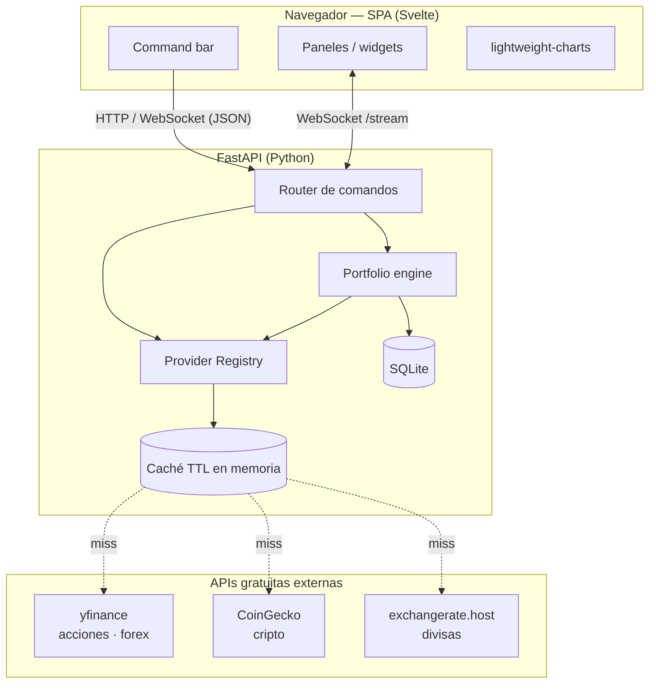
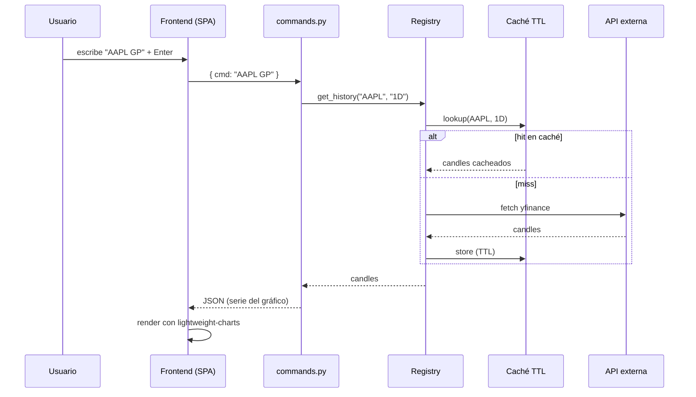
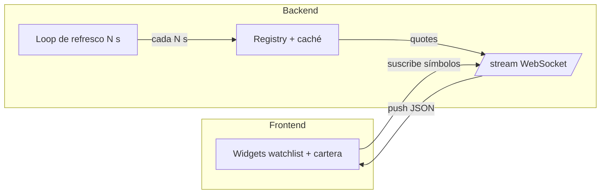
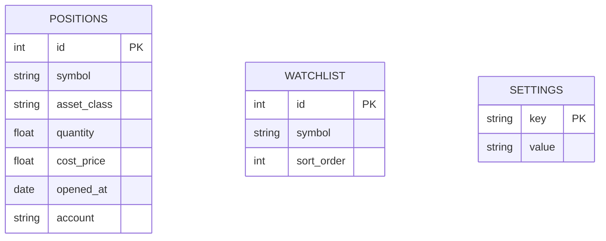

# sterminal — Especificación (viva)

> **Documento vivo.** Refleja el estado actual del proyecto y se actualiza al cerrar
> cada ciclo de feature (ver [`docs/sys/workflow.md`](workflow.md), sección D y H).
> El original congelado de partida está en [`spec-initial.md`](spec-initial.md) — no se
> modifica nunca. Esta copia sí se edita: cuenta la historia real del proyecto.

> Terminal financiero personal, estilo Bloomberg. App web local y privada que corre en
> la Raspberry Pi del usuario. Multi-activo (acciones/ETFs, cripto, forex/materias primas),
> datos de APIs gratuitas, navegación por línea de comandos con teclado, y cartera real
> por entrada manual/CSV con P&L en vivo.

- **Estado:** en implementación (MVP).
- **Features implementadas:**
  - feat-1 — Esqueleto backend: FastAPI + SQLite (esquema `positions`/`watchlist`/
    `settings`) + interfaz `Provider` (`Protocol`). Ver
    [`docs/sys/features/feat-1-backend-skeleton.md`](features/feat-1-backend-skeleton.md)
    y [`docs/plans/plan-1-backend-skeleton.md`](../plans/plan-1-backend-skeleton.md).
  - feat-2 — Providers base: `EquityProvider` (yfinance), `CryptoProvider` (CoinGecko),
    `FxProvider` (exchangerate.host), los tres cumpliendo el `Protocol Provider` de
    feat-1. Ver
    [`docs/sys/features/feat-2-providers-base.md`](features/feat-2-providers-base.md)
    y [`docs/plans/plan-2-providers-base.md`](../plans/plan-2-providers-base.md).
- **Fecha:** 2026-07-07
- **Stack elegida:** FastAPI (Python) + frontend Svelte + TradingView lightweight-charts + SQLite.
- **Diseño visual/UX (definitivo):** ver [`init-specs/DESIGN.md`](init-specs/DESIGN.md) —
  documento de diseño a aplicar en el desarrollo, con su prototipo autocontenido
  [`init-specs/sterminal.dc.html`](init-specs/sterminal.dc.html) (temas cobalt/amber/phosphor,
  layouts focus/grid, barra de comando, paneles y estados live/stale/error).
- **Brief de diseño (origen):** [`init-specs/design-brief.md`](init-specs/design-brief.md) —
  el brief con el que se generó el diseño (referencias visuales, comandos, prioridades y anti-patrones).

---

## 1. Objetivos y principios

- **Fiel al espíritu Bloomberg:** pantalla densa, teclado ante todo, barra de comando siempre presente.
- **Personal y privado:** todo corre en local, sin cuentas ni telemetría, sin autenticación (uso de un solo usuario en su máquina).
- **Ligero:** debe volar en una Raspberry Pi 5. Sin frameworks pesados, caché agresiva.
- **Multi-activo:** acciones/ETFs, cripto y forex/materias primas bajo la misma interfaz.
- **Extensible:** añadir una fuente de datos nueva no debe tocar el resto del sistema.
- **YAGNI:** nada de trading real, brokers ni multiusuario en la v1.

---

## 2. Arquitectura general

Tres capas con fronteras claras: **frontend** (render + teclado), **API/comandos**
(traduce comando → acción) y **providers + engine** (datos y cálculo). Cada provider
implementa la misma interfaz, así que añadir una fuente no toca el resto.



---

## 3. Componentes del backend

| Módulo | Responsabilidad |
|---|---|
| `providers/` | Un módulo por fuente, todos con interfaz común. `EquityProvider` (yfinance), `CryptoProvider` (CoinGecko), `FxProvider` (exchangerate.host). |
| `registry.py` | Enruta el símbolo a su provider según clase de activo; desambigua choques. |
| `cache.py` | Caché en memoria con TTL para respetar límites de las APIs gratuitas. Clave por símbolo + resolución. |
| `portfolio.py` | Lee posiciones de SQLite, cruza con precios en vivo, calcula P&L, coste medio, % asignación, P&L diario. Import/export CSV. |
| `commands.py` | Parser del lenguaje de comandos. Mapea entrada → handler → payload JSON. |
| `app.py` | FastAPI: endpoints REST + WebSocket `/stream` que empuja precios de watchlist/cartera cada N segundos. |

### Interfaz común de provider

Todos los providers cumplen el mismo contrato, lo que permite añadir fuentes (o, más
adelante, conectores de exchange) sin reescribir el router ni el engine:

```
class Provider(Protocol):
    def get_quote(symbol) -> Quote
    def get_history(symbol, resolution) -> list[Candle]
    def search(query) -> list[SymbolMatch]
    def get_news(symbol) -> list[NewsItem]
```

TTL de caché sugerido: cotización ~15 s, histórico intradía ~1 min, histórico diario ~5 min.

### Estructura del proyecto backend e implementación (desde feat-1)

- **Paquete:** `backend/` en la raíz del repo, src-layout con el código en
  `backend/app/` y tests en `backend/tests/`:

  ```
  backend/
    pyproject.toml
    app/
      __init__.py
      main.py          # FastAPI app + endpoint de health-check
      db.py             # conexión SQLite + init_db()
      models.py         # Quote, Candle, SymbolMatch, NewsItem
      providers/
        __init__.py
        base.py         # Protocol Provider
    tests/
      __init__.py
      test_app.py
      test_db.py
      test_provider_protocol.py
  ```

  Se usa src-layout (en vez de paquete plano en la raíz) para dejar sitio a un futuro
  `frontend/` en la raíz sin mezclar código Python y JS/TS en el mismo nivel.
- **Gestor de dependencias:** `pip` + `venv` estándar, con `backend/pyproject.toml`
  (build backend `setuptools`) como fuente única de metadatos y dependencias runtime
  (`fastapi`, `uvicorn`) y de test (`pytest`, `httpx`). Elegido por cero fricción y cero
  tooling externo adicional en la Raspberry Pi (nada de `poetry`/`uv`).
  Entorno virtual local en `backend/.venv`, ignorado por git.
- **SQLite:** módulo `sqlite3` de la librería estándar, sin ORM — suficiente para el
  esquema de tres tablas de la sección 6.
- **Tipos de dominio (`Quote`, `Candle`, `SymbolMatch`, `NewsItem`):** `dataclasses`
  estándar de Python, no modelos pydantic — para mantener el `Protocol Provider`
  desacoplado de FastAPI/pydantic. Son tipos de dominio internos; si hace falta
  serializarlos a modelos de request/response HTTP, eso se resuelve en los endpoints de
  negocio (feature 5), que podrán envolverlos o mapearlos.
- **Convención de tests:** `pytest`, un fichero de test por módulo principal
  (`test_app.py`, `test_db.py`, `test_provider_protocol.py`), ejecutado desde `backend/`.
  Sin llamadas a red real en los tests (aplica también a providers futuros, ver sección
  9).

### Providers implementados (desde feat-2)

- **`EquityProvider`** (`backend/app/providers/equity.py`): acciones/ETFs vía
  `yfinance`. Símbolo de entrada: ticker de Yahoo Finance tal cual (`AAPL`, `MSFT`,
  ...). `get_history` devuelve OHLCV completo, sin limitaciones conocidas.
- **`CryptoProvider`** (`backend/app/providers/crypto.py`): cripto vía la API pública de
  CoinGecko (HTTP directo con `httpx.Client` inyectable). Símbolo de entrada: **id de
  CoinGecko** (`bitcoin`, `ethereum`, ...), no el ticker corto (`BTC`) — mapear
  ticker→id es responsabilidad de `registry.py` (feature 3); mientras tanto, `search()`
  permite resolverlo a mano. `get_history` usa `/coins/{id}/ohlc` (OHLC real) pero
  **sin volumen** en el tier gratuito (`Candle.volume` queda a `0.0`). `get_news`
  devuelve `[]` de forma documentada — CoinGecko no expone noticias por activo en su
  API pública gratuita.
- **`FxProvider`** (`backend/app/providers/fx.py`): forex/materias primas vía la API
  pública de exchangerate.host (HTTP directo con `httpx.Client` inyectable). Símbolo de
  entrada: par de 6 caracteres `BASECOTIZADA` (ej. `EURUSD` = base EUR, cotizada USD).
  `get_history` da un único rate por día (`/timeseries`), **sin OHLC intradía** — cada
  `Candle` se construye con `open=high=low=close=rate` del día y `volume=0.0`.
  `get_news` devuelve `[]` de forma documentada. Requiere API key — ver sección 11.
- **Dependencias runtime nuevas:** `yfinance` y `httpx` en `[project].dependencies` de
  `backend/pyproject.toml` (`httpx` ya estaba como dependencia de test, ahora también de
  runtime).
- **Tests:** fixtures HTTP grabadas en `backend/tests/fixtures/`; `CryptoProvider`/
  `FxProvider` mockean el transporte con `httpx.MockTransport`, `EquityProvider` usa
  factories inyectables (`ticker_factory`, `search_factory`) porque `yfinance` no
  expone un cliente HTTP interceptable de forma estable entre versiones.

---

## 4. Lenguaje de comandos (el alma Bloomberg)

Barra de comando siempre enfocada. Sintaxis: `[SÍMBOLO] [FUNCIÓN]` o `FUNCIÓN`. Detección
automática de clase de activo por símbolo, con desambiguación cuando choca (ej. `BTC`
cripto vs. acción). Historial con ↑/↓ y autocompletado.

| Comando | Acción |
|---|---|
| `AAPL` | Panel de resumen del activo (precio, gráfico, stats). |
| `BTC GP` | Gráfico de precio (Graph Price). |
| `AAPL NEWS` | Noticias del activo. |
| `PORT` | Cartera: posiciones, P&L, asignación. |
| `WATCH` | Watchlist en vivo. |
| `EURUSD` | Cotización forex. |
| `MOVERS` | Mayores subidas/bajadas del día. |
| `HELP` | Lista de comandos. |

### Ciclo de vida de un comando



---

## 5. Actualización en vivo (WebSocket)

Los símbolos de la watchlist y de la cartera se refrescan solos vía WebSocket `/stream`,
sin recargar ni consultar a mano.



---

## 6. Persistencia (SQLite)



- **`positions`** — posiciones reales; el engine calcula P&L cruzando con precio en vivo.
- **`watchlist`** — símbolos seguidos, con orden.
- **`settings`** — moneda base, tema, intervalo de refresco.

Entrada de cartera: manual o import CSV (`symbol, quantity, cost_price, date, account`).
Export CSV para respaldo.

---

## 7. Estética

- Fondo negro, texto ámbar/verde monoespaciado (tributo Bloomberg).
- Cabeceras densas, layout de rejilla con paneles, cero ratón necesario.
- Números con color por signo (verde positivo / rojo negativo).

---

## 8. Errores y límites

- **API caída o rate-limit** → el panel muestra el último dato cacheado con aviso `stale`, nunca pantalla en blanco.
- **Símbolo no encontrado** → sugerencias vía `search()`.
- **Backend degradado** → sirve lo último conocido en lugar de fallar.

---

## 9. Testing

- **Unit:** parser de comandos, engine de P&L (con precios mockeados), import CSV.
- **Providers:** respuestas HTTP grabadas como fixtures; los tests no pegan a la red real.
- **Smoke test:** flujo completo comando → JSON.

---

## 10. Fuera de alcance (v1)

Órdenes reales / trading, conexión a brokers, alertas push, multiusuario y autenticación
(es local). La interfaz común de providers se diseña para poder añadir conectores de
exchange más adelante **sin reescribir** el núcleo.

---

## 11. Preguntas abiertas / decisiones futuras

- Confirmar proveedor de noticias gratuito (yfinance expone algo; evaluar alternativa).
- Intervalo `N` de refresco del WebSocket (arrancar en ~15 s, configurable en `settings`).
- Framework de frontend definitivo (Svelte recomendado por peso; confirmar en el plan).
- **`exchangerate.host` ahora exige API key (detectado en feat-2):** el endpoint público
  devuelve `missing_access_key` sin una clave de acceso — el proveedor cambió de
  modelo desde que se escribió `spec-initial.md` y ahora opera bajo el paraguas de
  apilayer. `FxProvider` acepta `api_key: str | None = None` por constructor (o lee
  `EXCHANGERATE_HOST_API_KEY` del entorno) y lo añade como query param `access_key`.
  Los tests no dependen de esto (mockean el transporte HTTP), pero **antes de que
  `FxProvider` funcione contra la API real en producción, el owner necesita conseguir
  una key gratuita de exchangerate.host/apilayer** y configurar la variable de entorno
  en el despliegue de la Raspberry Pi.
